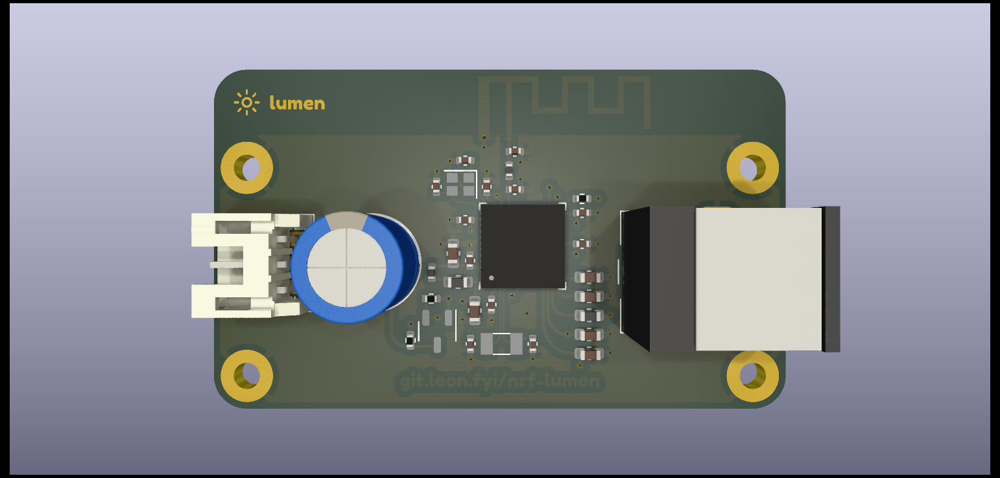

# nrf-lumen

nRF52840 NeoPixel controller board




## Initialization

> [!IMPORTANT]
> Make sure you have a proper Zephyr development environment according to the
> official documentation.

```sh
west init -m https://git.leon.fyi/lumen-sdk --mr main lumen-workspace # or
west init -m https://github.com/leonrinkel/lumen-sdk --mr main lumen-workspace
cd lumen-workspace
west update
```

## Building

```sh
west build -b lumen lumen-sdk/app # or
west build -b lumen lumen-sdk/app -- -DOVERLAY_CONFIG=debug.conf
```

## Flashing

```sh
west flash --runner jlink # or
west flash --runner pyocd
```

## Over-The-Air Update

Building automatically produces an `app_update.bin` file in the `build/zephyr`
directory. This file can be used to update firmware using the
[nRF Connect Device Manager][1].


## License

Please see [hardware/LICENSE](hardware/LICENSE) and [lumen-sdk][2]. The software
side of this project is based on [Zephyr][3] which is mostly licensed under the
[Apache-2.0][4] license.

[1]: https://www.nordicsemi.com/Products/Development-tools/nrf-connect-device-manager
[2]: https://git.leon.fyi/lumen-sdk
[3]: https://www.zephyrproject.org
[4]: http://www.apache.org/licenses/LICENSE-2.0
